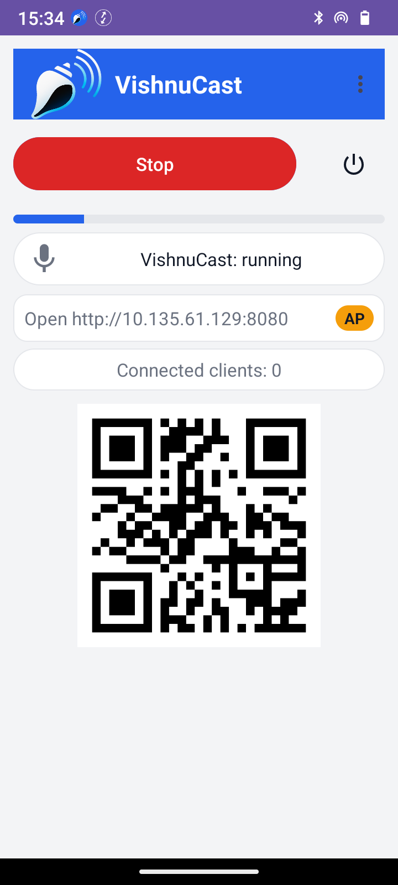
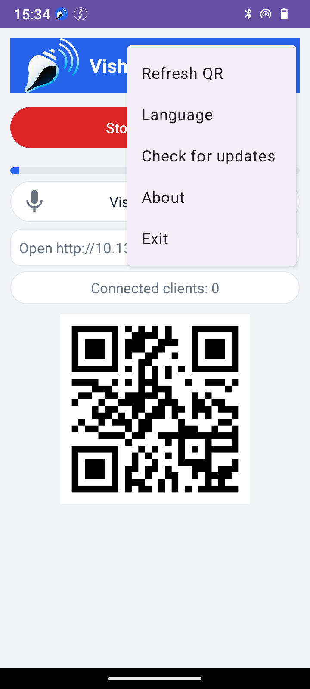

    

# VishnuCast

[RU](#ru)

---

## EN

**VishnuCast** is an Android foreground service that streams microphone audio (built-in or external) to client browsers within a local network (e.g., via Wi-Fi hotspot).

A simple and convenient alternative to a radio microphone for lecturers or tour guides, with zero broadcast costs. A clip-on microphone of any type can be used if desired.

### What's new in 1.7

- New application update procedure

### App principle

When the app is launched, the **servers are up** and **microphone is muted by default**.
The Big button only toggles **mute/unmute** – it **does not** start/stop servers.

### Features

- The HTTP/WebSocket signaling server is built into the app (NanoHTTPD + WebRTC).
- Port: first free from **HTTP 8080 (8081, 8082 ...)**
- Client: mobile browsers (iOS Safari, Android Chrome)
- Start/Stop (mute/unmute) broadcast from the lecturer’s phone
- Local IP & QR code (`http://IP:8080`)
- Pull-to-refresh to update IP/QR
- RU/EN UI
- No app needed for listeners ― **browser only**
- Support for any microphones - both built-in and external.
- Checking and downloading updates

### Install (APK)

- Download the latest APK from [Releases](https://github.com/dmbuligin/VishnuCast/releases).
- Allow installation from unknown sources (Android).
- Launch the app, **grant microphone** and **(Android 13+) notifications** permissions.

### Build from source

 - **git clone https://github.com/dmbuligin/VishnuCast.git**
 - Open in Android Studio (compileStkd = 36, targetSdk = 34).
 - Build a **Release APK**.

### Usage

1. Start the app on the lecturer’s phone (Wi-Fi or personal hotspot).
2. Tap the big button to **unmute** | **mute**.
3. Audience opens `http://<your_IP>:8080`in a mobile browser.
4. To **exit** long-press the square ☉ button on the right.

### Notes

* On iOS, the first user tap may be required to enable audio — the client page handles it softly.
* Use the ⏻ button in the app to stop services and exit reliably.

### License

This project is licensed under the [MIT License](LICENSE).

### Screenshots

   

### Contributing
Contributions are welcome!
Please see [CONTRIBUTING.md](CONTRIBUTING.md) for detailed guidelines.

### Credits

Project by **dmbuligin** aka **Mr. Dima**, with AI collaboration. 
Created in deep respect for my Guru — [Vishnu Sharan Shukla](https://yogasanskar.ru/)

## RU

**VishnuCast** — Android-сервис, транслирующий звук с микрофона (встроенного или внешнего) в браузер клиента внутри локальной сети (например -  через собственный хот-спот).

Простая и удобная альтернатива радиомикрофону для лекторов или экскурсоводов, при нулевых затратах на организицаю трансляции. При желании можно использовать микрофон - прищепку любого типа.

### Что нового в 1.7

- Новая процедура обновления приложения

* ### Главный принцип

  Приложение запущено → **серверы подняты**, **микрофон по умолчанию MUTE**.
  Большая кнопка управляет **только mute/unmute** — **и не делает** старт/стоп серверов.

  ### Возможности
- HTTP/WS-сигналинг встроен (NanoHTTPD + WebRTC).
- Порт: первый свободный от **HTTP 8080 (8081, 8082 …)**
- Клиент: мобильные браузеры (iOS Safari, Chrome на Android)
- Управление трансляцией с телефона лектора (mute/unmute)
- Отображение локального IP и QR-кода (`http://IP:8080`)
- Обновление IP/QR жестом протяжки вниз
- Двуязычный UI (RU/EN)
- Слушателям ничего ставить не нужно — **только браузер**
- Поддержка любых микрофонов - как встроенного, так и внешних.
- Проверка и загрузка обновлений

### Установка (APK)

 - Скачайте последний релиз на вкладке [Releases](https://github.com/dmbuligin/VishnuCast/releases).
 - Разрешите установку из неизвестных источников (Android).
 - При первом запуске дайте доступ к **микрофону** и (Android 13+) **уведомлениям**.

  ### Сборка из исходников
 - **git clone https://github.com/dmbuligin/VishnuCast.git**
 - Откройте проект в Android Studio (compileSdk = 36, targetSdk = 34).
 - Соберите Release APK.

### Использование

1. Запустите приложение на телефоне лектора (можно с включённым хот-спотом).
2. Тап по большой кнопке — **unmute/mute**.
3. Слушатели подключаются по адресу `http://<ваш_IP>:8080` в браузере.
4. **Выход** — **долгое нажатие** на квадратную кнопку **⏻**.

### Замечания

* На iOS для запуска звука может понадобиться первый пользовательский тап — клиентская страница это учитывает.
* Используйте кнопку ⏻ в приложении для остановки служб и безопасного выхода.

### Лицензия

Проект распространяется под [лицензией MIT](LICENSE)

### Участие в разработке

Мы открыты для ваших идей и правок!
Подробные правила — в [CONTRIBUTING.md](CONTRIBUTING.md).

### Скриншоты

   

Создано в знак глубокого уважения к моему Гуру — [Вишну Шаран Шукла](https://yogasanskar.ru)
