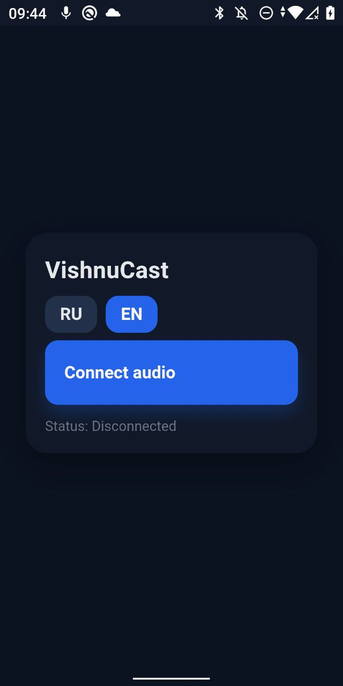

<p align="center">
    
</p>


# VishnuCast


[RU](#ru)

---

## EN

**VishnuCast** is an Android service that streams microphone audio (built-in or external) to clients  browsers within a local network (e.g., via Wi-Fi hotspot).
The server is built into the app (NanoHTTPD + WebRTC).

A simple and convenient alternative to a radio microphone for lecturers or tour guides.

- Port: first free from **HTTP 8080 (8081, 8082 ...)**
- Client: mobile browsers (iOS Safari, Android Chrome)
- Package: `com.buligin.vishnucast`

### Features
- Start/Stop broadcast from the lecturer’s phone
- Automatic network selection: WiFi, AP, eth...
- Shows local IP & QR code `http://IP:8080`
- RU/EN UI
- No app needed for listeners — browser only

### Install (APK)
- Download the latest APK from [Releases](https://github.com/dmbuligin/VishnuCast/releases).
- Allow installation from unknown sources (Android).
- Launch the app, grant microphone access, start broadcasting.

### Build from source
```bash
git clone https://github.com/dmbuligin/VishnuCast.git
```

* Open in **Android Studio** (compileSdk = 36, targetSdk = 34).
* Build a **Release APK**.

### Usage
1. Start the app on the lecturer’s phone (hotspot optional).
2. Long tap to button to start/stop server
3. Audience opens `http://<your_IP>:8080` in a mobile browser.

### Notes
* On iOS the first tap may be required to enable audio — the client handles it.

### License
This project is licensed under the [MIT License](LICENSE).

### Screenshots
<p align="center">
  
  
</p>

## Contributing
Contributions are welcome!
Please see [CONTRIBUTING.md](CONTRIBUTING.md) for detailed guidelines.

### Credits
Project by dmbuligin aka **Mr. Dima**, with AI collaboration.

Created in deep respect for my Guru — [Vishnu Sharan Shukla](https://yogasanskar.ru/)

* * *

RU
--

**VishnuCast** — Android-сервис, транслирующий звук с микрофона (встроенного или внешнего) в браузер клиента внутри локальной сети (например, через хот-спот).
Сервер встроен в приложение (NanoHTTPD + WebRTC).

Простая и удобная альтернатива радиомикрофону для лекторов или экскурсоводов.

- Порт: первый свободный от **HTTP 8080 (8081, 8082 ...)**
- Клиент: мобильные браузеры (iOS Safari, Chrome на Android)
- Пакет: `com.buligin.vishnucast`

### Возможности
- Старт/стоп трансляции с телефона-лектора
- Автоматический выбор сети: WiFi, AP, eth...
- Отображение локального IP и QR-кода `http://IP:8080`
- Двуязычный UI (RU/EN)
- Минимальные требования к слушателям — только браузер

###### Установка (APK)
* Скачайте последний релиз на вкладке [Releases](https://github.com/dmbuligin/VishnuCast/releases).
* Разрешите установку из неизвестных источников (Android).
* Запустите приложение, дайте доступ к микрофону, начните трансляцию.

### Сборка из исходников
```bash
git clone https://github.com/dmbuligin/VishnuCast.git
```
* Откройте проект в **Android Studio** (compileSdk = 36, targetSdk = 34).
* Соберите **Release APK**.

### Использование
1. Запустите приложение на телефоне лектора (можно с включённым хот-спотом).
2. Долгое нажатие кнопки для старта/остановки сервера
3. Слушатели подключаются по адресу `http://<ваш_IP>:8080` в браузере.

### Замечания
* В iOS первый тап может быть нужен для запуска аудио — клиент это мягко обрабатывает.

### Лицензия
Проект распространяется под [лицензией MIT](LICENSE).

## Участие в разработке
Мы открыты для ваших идей и правок!
Подробные правила смотрите в [CONTRIBUTING.md](CONTRIBUTING.md).

### Скриншоты
<p align="left">
    
    
</p>

-------

Создано в знак глубокого уважения к моему Гуру — [Вишну Шаран Шукла](https://yogasanskar.ru)
